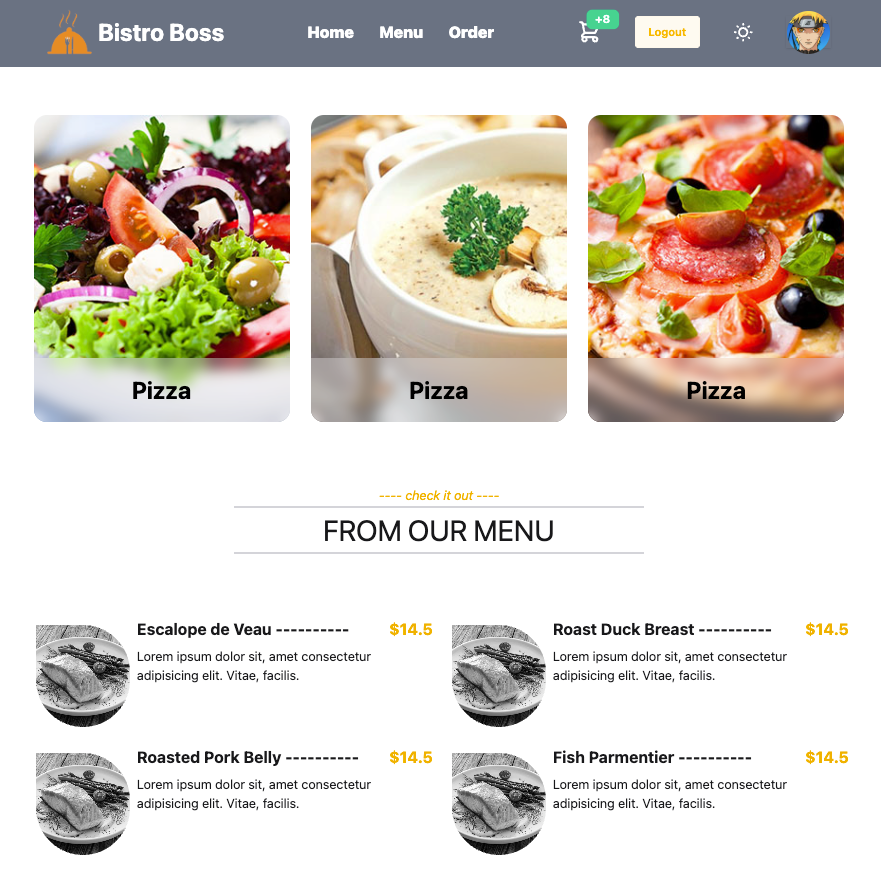
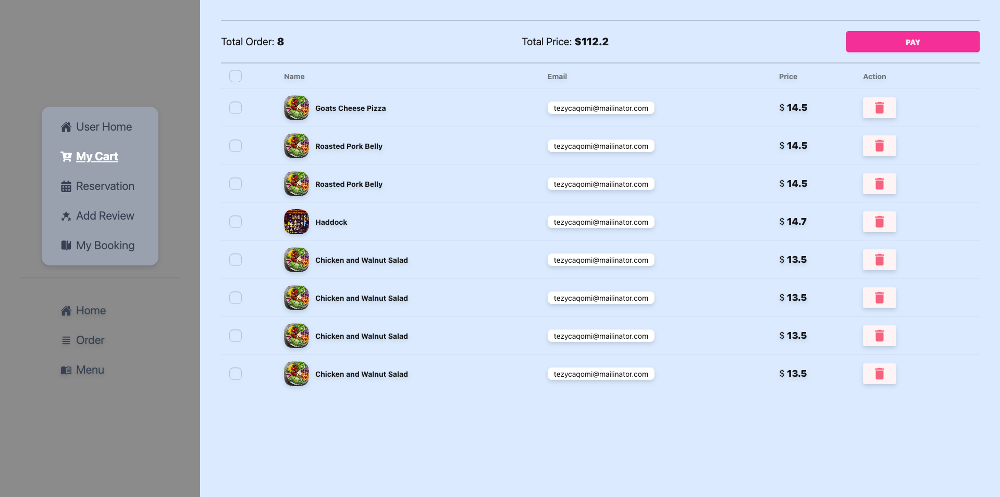

# 🤩 Bistro Boss – Full Stack Web App

A modern full-stack restaurant or food ordering application built using:

- 🧠 **Frontend**: React 19, Vite, TailwindCSS, DaisyUI, React Hook Form, TanStack Query, GSAP, **React Toastify**
- ⚙️ **Backend**: Express.js, MongoDB, Node.js
- 🔐 **Features**: Auth (Firebase), EmailJS, Dark/Light Theme, Animated UI, Toast Notifications

---

## 📦 Project Structure

```
.
├── client/      → React + Vite frontend
└── backend/     → Node.js + Express backend
```

---

## 🚀 Features

### 🔹 Frontend (`/client`)

- ⚡ Vite-powered React 19 app
- 🎨 Beautiful responsive UI with **TailwindCSS + DaisyUI**
- 🔄 **React Hook Form** with Zod validation
- 📱 API requests with **Axios**
- ⚛️ **TanStack Query** for data fetching and caching
- ✨ **GSAP animations** and parallax effects
- 🔔 **React Toastify** for toast notifications
- 🔐 **Firebase authentication**
- 🌗 Light/Dark theme toggle using DaisyUI
- 📬 Email support via **EmailJS**

### 🔹 Backend (`/backend`)

- 🖥️ Express server with REST API endpoints
- 📂 MongoDB with native driver
- 🔐 CORS + environment variables with `dotenv`
- 🔄 Nodemon for live reload in development

---

## 🛠️ Tech Stack

| Layer         | Technology                        |
| ------------- | --------------------------------- |
| Frontend      | React, Vite, TailwindCSS, DaisyUI |
| Animations    | GSAP, React Parallax              |
| State/Data    | React Hook Form, TanStack Query   |
| Notifications | React Toastify                    |
| Auth          | Firebase Auth                     |
| Backend       | Express.js, MongoDB, Nodemon      |
| Email         | EmailJS                           |

---

## 🔔 Toast Notification (React Toastify)

To use toast notifications:

1. Install:

   ```bash
   npm install react-toastify
   ```

2. Add in your root file (e.g., `main.jsx` or `App.jsx`):

   ```jsx
   import { ToastContainer } from "react-toastify";
   import "react-toastify/dist/ReactToastify.css";

   function App() {
     return (
       <>
         {/* Your routes and layout */}
         <ToastContainer />
       </>
     );
   }
   ```

3. Trigger a toast:

   ```js
   import { toast } from "react-toastify";

   toast.success("Added to cart!");
   ```

---

## 📂 Getting Started

### 📦 Backend

```bash
cd backend
npm install
npm run start
```

Make sure you add your `.env` file:

```env
PORT=5000
MONGODB_URI=your_mongodb_connection_string
```

---

### 💻 Frontend

```bash
cd client
npm install
npm run dev
```

---

## 🌐 Environment Variables

- **Backend**:

  - `PORT` – your backend server port
  - `MONGODB_URI` – your MongoDB connection string

- **Frontend**:

  - Firebase config
  - EmailJS public key

Use `.env` files in both folders and load them securely.

---

## 📸 Screenshots




---

## 📬 Contact

Created with 💙 by \[Argho Dev]

> Feel free to open an issue or pull request for suggestions or improvements.
